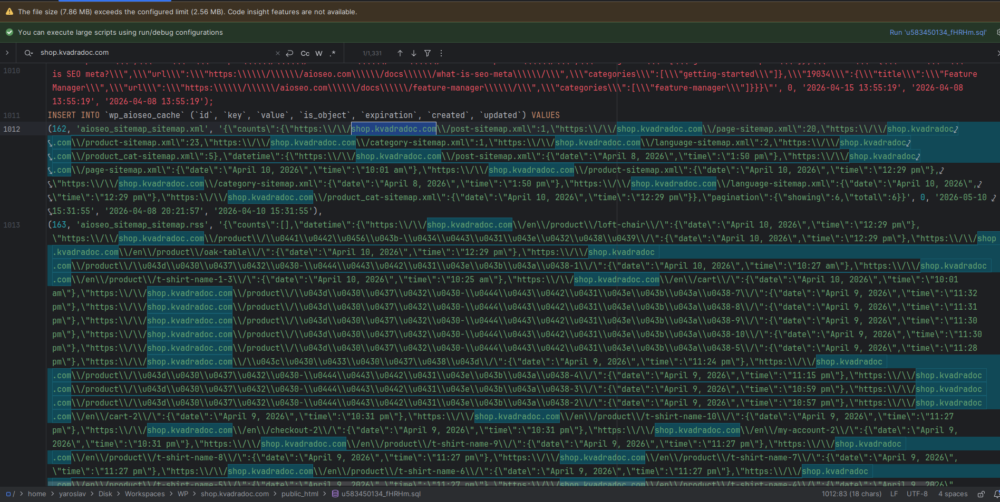
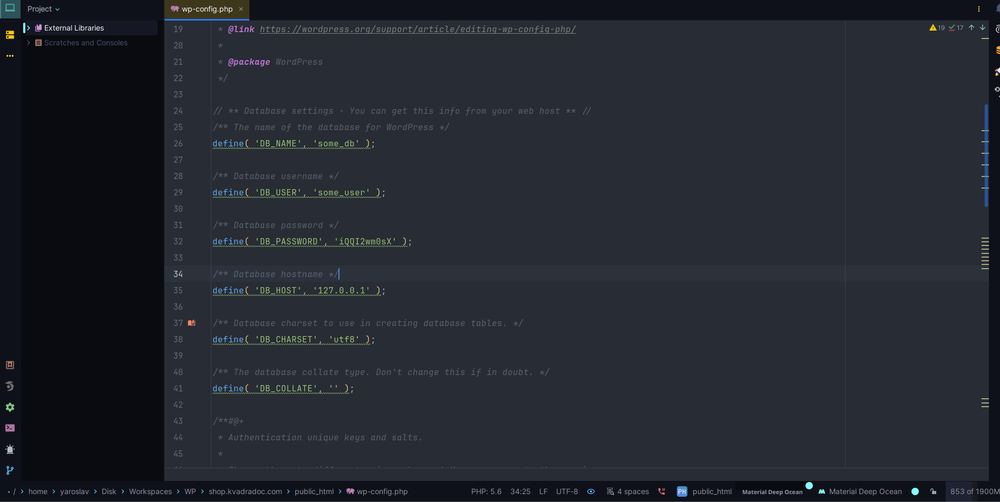
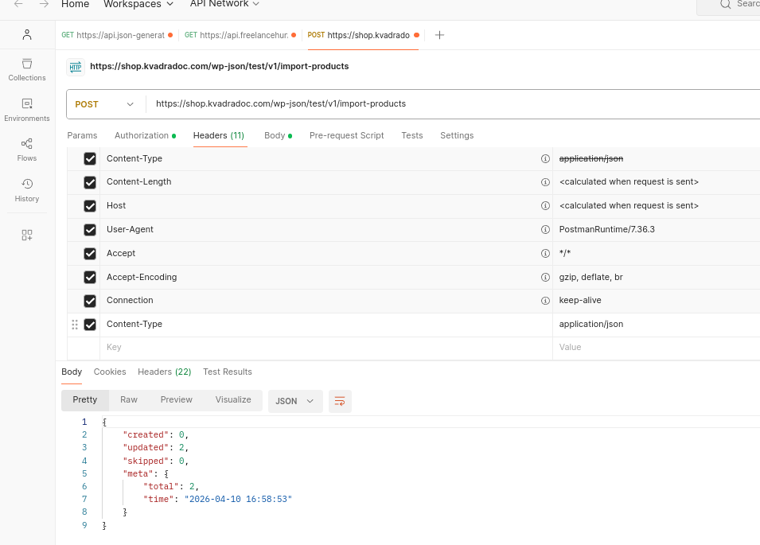
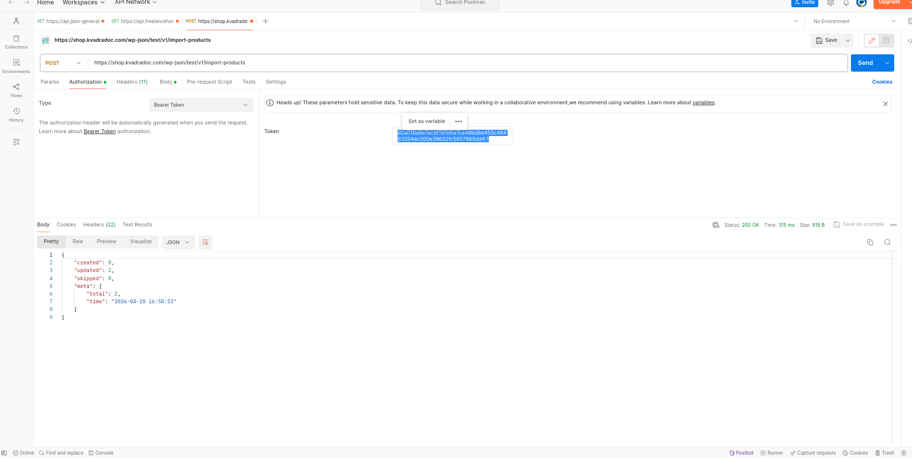
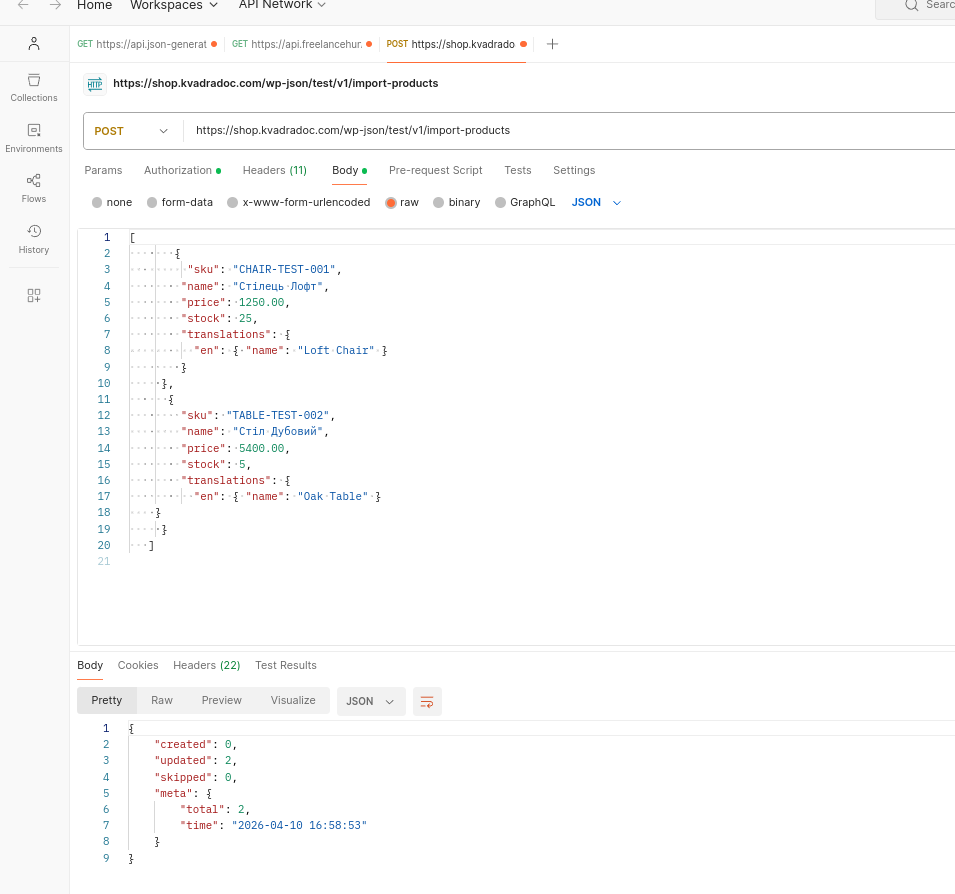

# Інструкція з розгортання WordPress

1. **Файли:** Завантажте всі файли на сервер (Apache/Nginx).
   
Замінити домен через текстовий редактор `shop.kvadradoc.com` на свій домен
2. **База даних:** Створіть нову БД та імпортуйте в неї SQL-дамп `u583450134_fHRHm.sql` (копія бази також знаходиться в гілці `database`).

3. **Конфігурація:** У файлі `wp-config.php` вкажіть актуальні дані підключення до бази:
   - `DB_NAME` — ім'я бази даних
   - `DB_USER` — користувач
   - `DB_PASSWORD` — пароль
   - `DB_HOST` — зазвичай `localhost` або IP сервера

4. **Права доступу:** Встановіть права запису для директорії `wp-content/uploads` (рекомендовано `755` для папок).
5. **Версія PHP:** Рекомендовано 8.1 або вище.
6. Робота з API `https://shop.kvadradoc.com/wp-json/test/v1/import-products`
7. **Додати Headers:** `Content-Type:application/json`

8. **Bearer Token:** `d2a016a9e7ecbf197d5a7ca49bd6e450c48463204ac000e39602fc5657865dd4:1`

9. Додати тіло для надсилання товарів:
`[
 {
   "sku": "CHAIR-001",
   "name": "Стілець",
   "price": 49.99,
   "stock": 10,
   "translations": {
     "en": { "name": "Chair" }
   }
 }
]`
